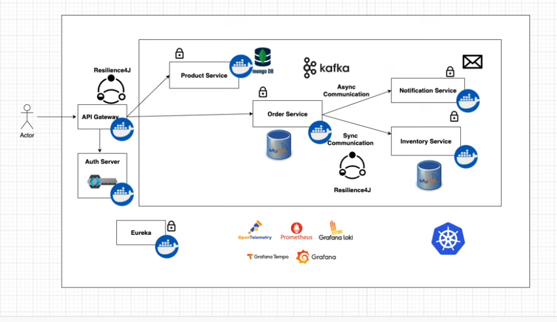

# 🛒 ECommerce Microservices

Este projeto implementa uma arquitetura completa de **E-Commerce baseada em microsserviços**, utilizando **Spring Boot**, **Docker**, **Kafka**, **Grafana Stack** (Prometheus, Loki e Tempo) e **Keycloak** para autenticação.  
O objetivo é demonstrar uma solução escalável, observável e resiliente para um ecossistema de comércio eletrônico moderno.

---

## 🧩 Arquitetura



A arquitetura segue o padrão de microsserviços, com comunicação síncrona e assíncrona entre os componentes.

### Principais componentes:

| Serviço | Função | Tecnologias |
|----------|--------|--------------|
| **API Gateway** | Roteia as requisições entre os serviços, aplicando autenticação e resiliência | Spring Cloud Gateway, Resilience4J |
| **Auth Server** | Gerencia autenticação e autorização | Keycloak |
| **Product Service** | Cadastro e consulta de produtos | Spring Boot, MongoDB |
| **Order Service** | Processamento de pedidos, orquestrando os demais serviços | Spring Boot, MySQL, Kafka |
| **Inventory Service** | Controle de estoque | Spring Boot, MySQL |
| **Notification Service** | Envio de notificações assíncronas | Spring Boot, Kafka |
| **Eureka Server** | Service discovery entre microsserviços | Netflix Eureka |
| **Monitoring Stack** | Observabilidade, logs e métricas | Prometheus, Loki, Tempo, Grafana |

---

## ⚙️ Tecnologias Utilizadas

- **Java 17**
- **Spring Boot 3.5.5**
- **Spring Cloud Netflix Eureka**
- **Spring Cloud Gateway**
- **Spring Security / Keycloak**
- **Kafka**
- **MongoDB**
- **MySQL**
- **Docker & Docker Compose**
- **Grafana Stack (Prometheus, Loki, Tempo)**
- **OpenTelemetry**
- **Swagger / OpenAPI**


---

## 🚀 Como Executar o Projeto

### Pré-requisitos

- Docker e Docker Compose instalados
- Java 17+
- Maven 3.8+

### Passos para rodar o ambiente completo:

1. **Gerar os containers dos microsserviços**
   ```bash
   mvn clean package -DskipTests
Gerar as imagens Docker

```bash
mvn spring-boot:build-image
Executar via Docker Compose
```

```bash
docker-compose up -d
Acessar os serviços
```
Grafana: http://localhost:3000

Prometheus: http://localhost:9090

Keycloak: http://localhost:8181

API Gateway: http://localhost:9000

📘 Documentação Swagger
Cada microsserviço possui sua própria interface de documentação via Swagger UI:

Serviço	URL Swagger

Product Service	http://localhost:8080/swagger-ui.html

Order Service	http://localhost:8081/swagger-ui.html

Inventory Service	http://localhost:8082/swagger-ui.html

Notification Service	http://localhost:8083/swagger-ui.html

🧠 Observabilidade
O projeto inclui integração com Grafana, Prometheus, Tempo e Loki, permitindo:

Visualização de métricas e dashboards no Grafana.

Centralização de logs no Loki.

Rastreamento distribuído de requisições via Tempo.

Monitoramento em tempo real via Prometheus.

📈 Resiliência
Resilience4J aplicado no API Gateway e nos serviços para tolerância a falhas.

Circuit Breaker, Retry e Fallback implementados.

🧪 Testes
Para rodar os testes unitários e de integração:

👨‍💻 Autor
Caio Vinicius Batista